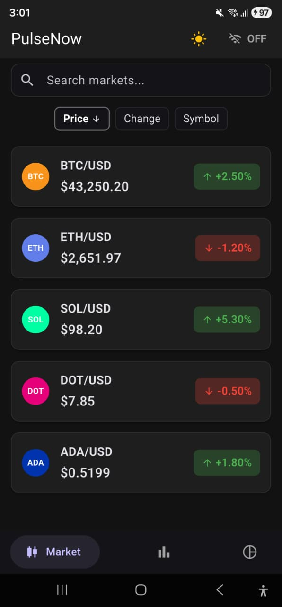
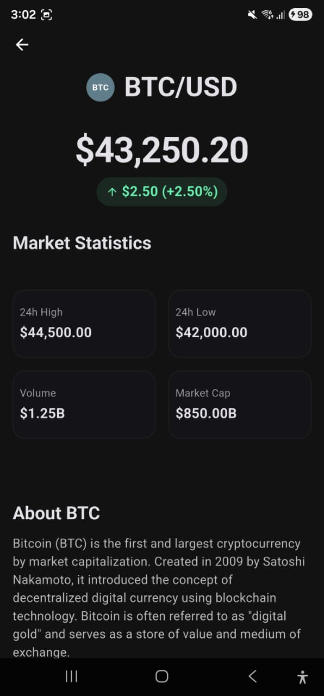
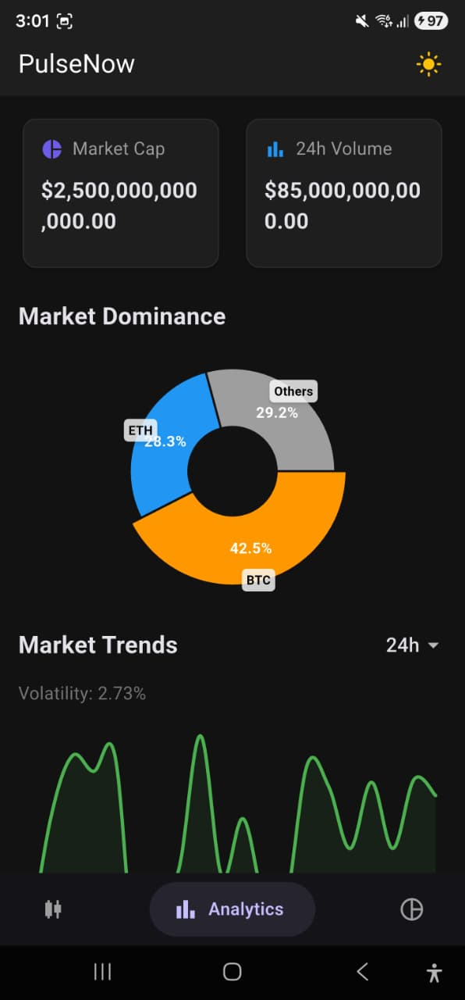
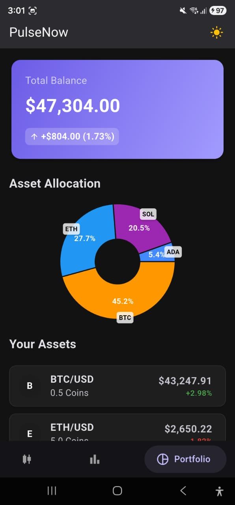

# PulseNow Flutter App

A modern cryptocurrency tracking and analytics Flutter application built as part of the PulseNow Developer Assessment.

## Screenshots

| Market Data | Market Detail | Analytics | Portfolio |
|:-----------:|:-------------:|:---------:|:---------:|
|  |  |  |  |

| Light Mode |
|:----------:|
|  |

---

## Features

### ✅ Core Features (Required)

- **REST API Integration** - Full integration with market data, analytics, and portfolio endpoints
- **Data Models** - Type-safe models with `Equatable`, `fromJson`, and null safety
- **State Management** - Clean architecture using `Provider` with loading/error states
- **UI Screens** - Professional ListView-based screens with color-coded price changes

### ⭐ Enhanced Features (Nice-to-Have)

- **Pull-to-Refresh** - Powered by `SmartRefresher` for seamless data updates
- **Real-time Updates** - WebSocket integration for live price changes
- **Search & Filter** - Search by symbol with instant results
- **Sorting** - Sort by price, change percentage, or symbol (asc/desc)
- **Detail View** - Tap any asset to see full market statistics
- **Dark Mode** - Complete dark theme with enhanced contrast
- **Skeleton Loading** - Elegant loading states using `Skeletonizer`
- **Error Handling** - Functional error types with `Either<Failure, Data>`
- **Analytics Dashboard** - Market trends, dominance charts, and top movers
- **Portfolio Tracking** - Asset allocation pie charts and holdings list
- **Unit Tests** - Comprehensive provider tests with `mocktail`

---

## Architecture

```
lib/
├── core/              # Theme & failure classes
│   ├── failure.dart
│   └── theme/
├── models/            # Data models (Equatable)
│   ├── analytics_model.dart
│   ├── market_data_model.dart
│   └── portfolio_model.dart
├── providers/         # State management (ChangeNotifier)
│   ├── analytics_provider.dart
│   ├── market_data_provider.dart
│   ├── navigation_provider.dart
│   └── portfolio_provider.dart
├── screens/           # UI screens
│   ├── analytics_screen.dart
│   ├── main_screen.dart
│   ├── market_data_screen.dart
│   ├── market_detail_screen.dart
│   └── portfolio_screen.dart
├── services/          # API & WebSocket services
│   ├── api_service.dart
│   └── websocket_service.dart
├── utils/             # Constants & extensions
│   ├── constants.dart
│   └── extensions.dart
├── widgets/           # Reusable UI components
│   ├── analytics_widgets.dart
│   ├── app_progress.dart
│   ├── market_detail_widgets.dart
│   ├── market_list_widgets.dart
│   ├── portfolio_widgets.dart
│   └── symbol_avatar.dart
└── main.dart          # App entry & DI setup
```

---

## Tech Stack

| Category | Technology |
|----------|------------|
| **Framework** | Flutter 3.x |
| **State Management** | Provider |
| **HTTP Client** | Dio |
| **WebSocket** | web_socket_channel |
| **Charts** | fl_chart |
| **Loading States** | Skeletonizer |
| **Pull-to-Refresh** | pull_to_refresh |
| **Testing** | flutter_test, mocktail |
| **Functional Types** | dartz (Either) |

---

## Getting Started

### Prerequisites

- Flutter SDK 3.0+
- Backend server running on `http://localhost:3000`

### Installation

```bash
# Clone the repository
cd flutter_app

# Install dependencies
flutter pub get

# Run the app
flutter run
```

### Running Tests

```bash
flutter test
```

---

## API Endpoints

The app integrates with the following backend endpoints:

| Endpoint | Description |
|----------|-------------|
| `GET /api/market-data` | List of crypto assets with prices |
| `GET /api/market-data/:symbol` | Single asset details |
| `GET /api/analytics/overview` | Market cap, volume, top movers |
| `GET /api/analytics/trend` | Historical price trend data |
| `GET /api/portfolio/overview` | Portfolio balance and P&L |
| `GET /api/portfolio/holdings` | List of user holdings |
| `WS /` | Real-time price updates |

---

## Assessment Checklist

### Required Features ✅

- [x] API Integration (`getMarketData()`)
- [x] Data Model (`MarketData` with `fromJson`)
- [x] State Management (`MarketDataProvider`)
- [x] UI Screen (ListView with color-coded changes)
- [x] Loading & Error States

### Nice-to-Have Features ✅

- [x] Pull-to-refresh
- [x] Currency formatting
- [x] Detail view navigation
- [x] Search/filter functionality
- [x] Sort options
- [x] WebSocket real-time updates
- [x] Dark mode support
- [x] Unit tests
- [x] Analytics API integration

---

## Author

Built with ❤️ for PulseNow
